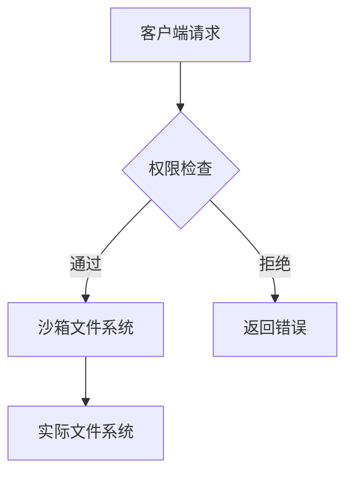

# MCP 文件服务实现规范

## 最小暴露原则
1. **资源定义**：
```json
{
  "resources": [
    {
      "uri": "file:///allowed_directory",
      "name": "可访问目录",
      "type": "directory",
      "permissions": ["read"]
    }
  ]
}
```

2. **基础工具集**：
```graphql
# 文件列表查询
query ListFiles($path: String!) {
  files(path: $path) {
    name
    size
    type
    modifiedTime
  }
}

# 文件内容读取
query ReadFile($path: String!) {
  file(path: $path) {
    content
    encoding
  }
}
```

3. **安全控制**：
```yaml
security:
  - OAuth2:
      scopes: [files.read]
  path_whitelist: 
    - "/var/data/public"
    - "/home/user/docs"
```

## 最大暴露方案
1. **扩展资源定义**：
```json
{
  "resources": [
    {
      "uri": "file:///",
      "name": "全文件系统",
      "type": "filesystem",
      "permissions": ["read", "write", "delete"],
      "metadata": {
        "quota": "10GB",
        "versioning": true
      }
    }
  ]
}
```

2. **完整工具集**：
```graphql
# 文件操作全集
mutation FileOperations($input: FileInput!) {
  writeFile(path: $input.path, content: $input.content) {
    checksum
  }
  deleteFile(path: $input.path) {
    success
  }
  createDirectory(path: $input.path) {
    created
  }
  searchFiles(query: $input.query) {
    results
  }
}

# 事务性操作示例
mutation SafeFileUpdate($input: FileUpdateInput!) {
  beginTransaction {
    id
  }
  backupFile(path: $input.path) {
    version
  }
  writeFile(path: $input.path, content: $input.content) {
    checksum
  }
  verifyFile(path: $input.path) {
    status
  }
  commitTransaction {
    success
  }
}
```

3. **增强安全机制**：
```yaml
security:
  - OAuth2:
      scopes: [files.*]
  - IPWhitelist: 
      - 192.168.1.0/24
  audit:
    log_path: /var/log/mcp_audit.log
    retention: 30d
```

## 协议设计要点
1. **服务发现**：
```json
{
  "mcp_version": "1.2.0",
  "protocols": {
    "file": "/api/filesystem/v1"
  },
  "capabilities": {
    "max_file_size": "100MB",
    "supported_encodings": ["utf8", "base64"]
  }
}
```

2. **OpenAPI 扩展**：
```yaml
paths:
  /files/{path}:
    get:
      x-mcp-risk-level: medium
      x-mcp-sanitize: true
    put:
      x-mcp-risk-level: high
      x-mcp-approval: required
```

## 安全实施建议
1. **沙箱隔离**：


2. **输入验证**：
```javascript
function sanitizePath(input) {
  return input.replace(/\.\./g, '').replace(/\/\//g, '/');
}
```

3. **审计日志**：
```json
{
  "timestamp": "2024-03-20T14:23:18Z",
  "operation": "file.write",
  "user": "ai_model@corp.com",
  "path": "/reports/q1.pdf",
  "result": "success",
  "checksum": "a1b2c3d4"
}
```

**设计原则**：
1. 最小暴露优先采用白名单机制
2. 写操作需双重验证（客户端+服务端）
3. 敏感操作强制审计日志
4. 动态加载访问策略（通过 MCP 配置接口）
5. 文件操作原子化设计
