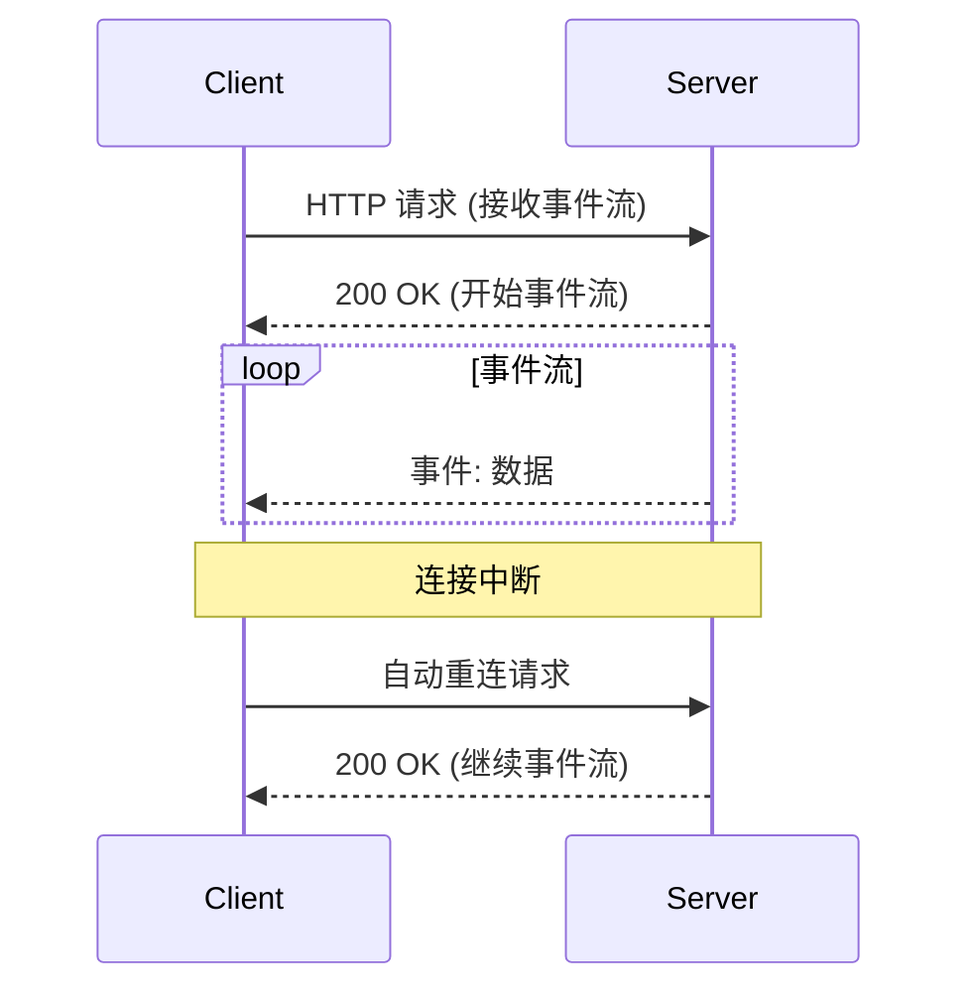

# Server-Sent Events (SSE) 时序图

```mermaid
sequenceDiagram
    participant Client
    participant Server

    Client->>Server: HTTP 请求 (接收事件流)
    Server-->>Client: 200 OK (开始事件流)
    loop 事件流
        Server-->>Client: 事件: 数据
    end
    Note over Client,Server: 连接中断
    Client->>Server: 自动重连请求
    Server-->>Client: 200 OK (继续事件流)
``` 