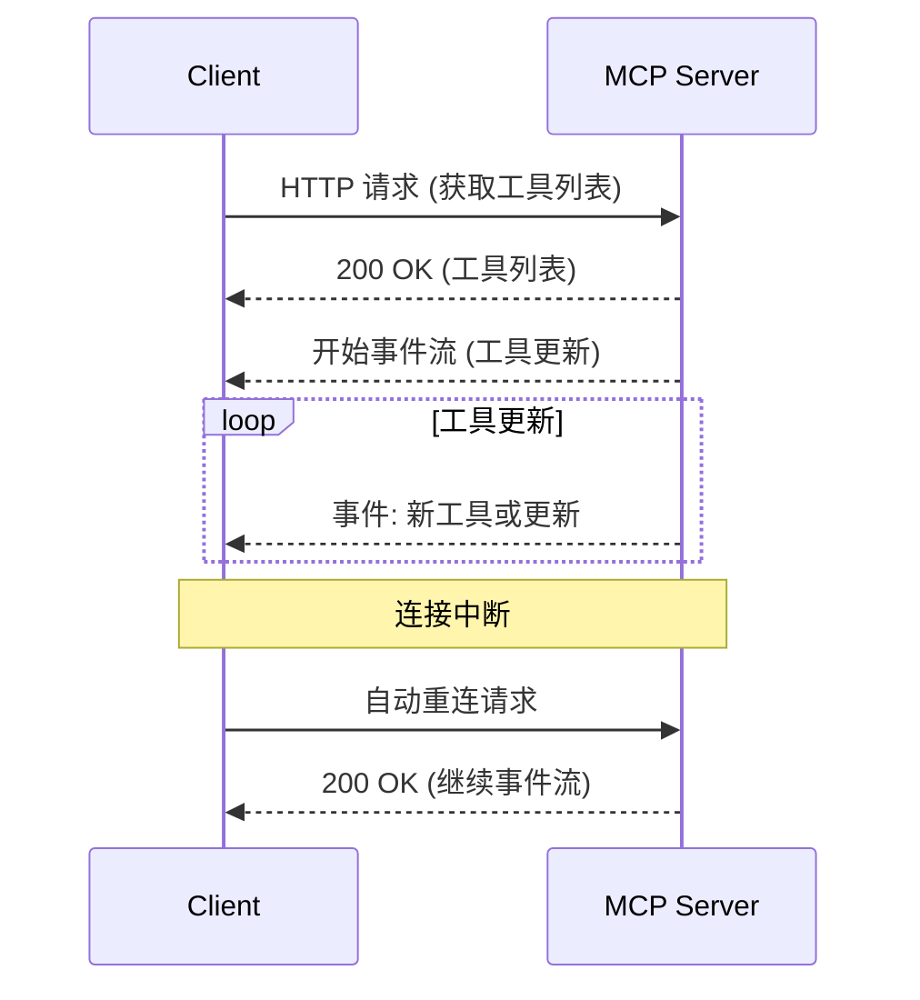

# SSE 初次请求工具列表时序图



# HTTP 请求和响应细节

## 客户端请求

客户端发送一个 HTTP GET 请求到 MCP 服务器以获取工具列表。请求的细节如下：

```
GET /tools HTTP/1.1
Host: mcp-server.example.com
Accept: text/event-stream
Connection: keep-alive
```

- **方法**: GET
- **路径**: /tools
- **头部**:
  - `Accept`: 指定客户端希望接收的内容类型为 `text/event-stream`，以便接收 SSE。
  - `Connection`: 设置为 `keep-alive` 以保持连接。

## 服务器响应

服务器处理请求并返回工具列表，响应的细节如下：

```
HTTP/1.1 200 OK
Content-Type: application/json

{
  "tools": [
    "Tool1",
    "Tool2",
    "Tool3"
  ]
}
```

- **状态码**: 200 OK
- **内容类型**: `application/json`
- **响应体**: 包含工具列表的 JSON 对象。 