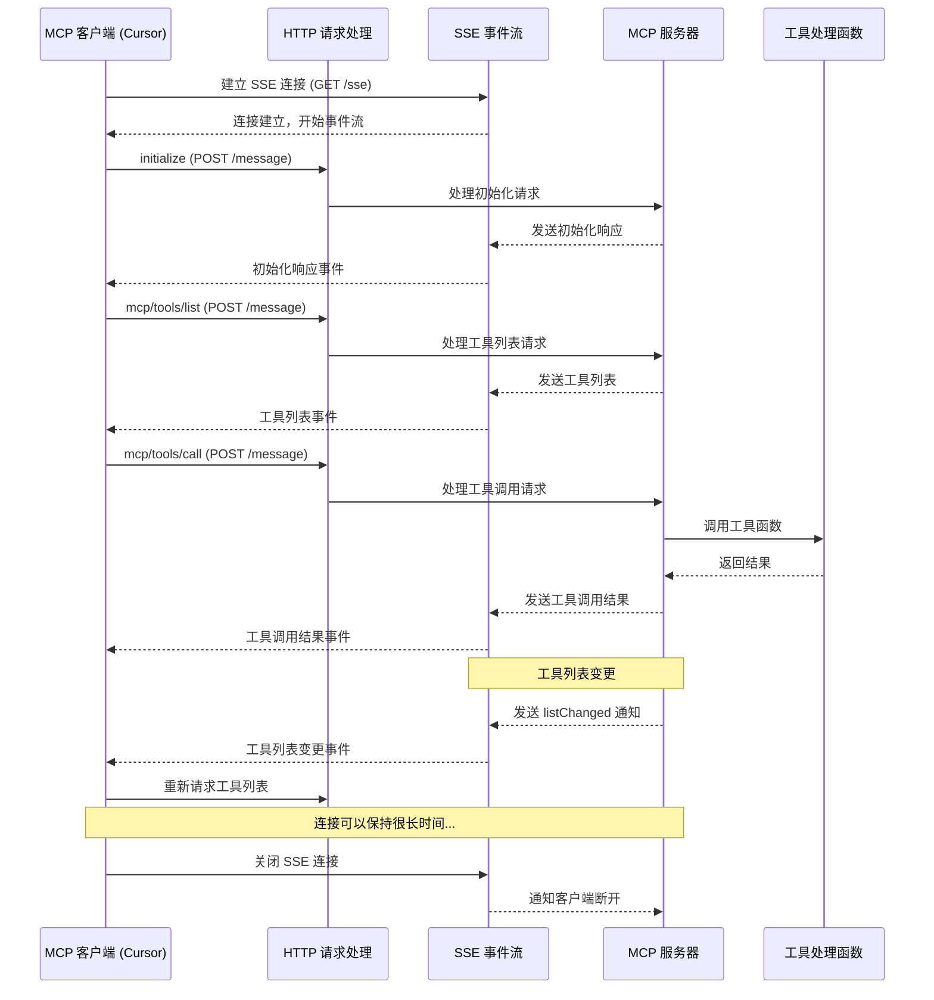

# SSE 模式下的 MCP 服务器调用流程

SSE（Server-Sent Events）模式是 MCP 服务器的另一种运行方式，它允许 MCP 客户端（如 Cursor IDE、Claude Desktop）通过 HTTP 连接与 MCP 服务器进行通信，服务器可以运行在本地或远程位置。与 stdio 模式不同，SSE 模式使用标准的网络通信，提供了更大的灵活性和可扩展性。

## MCP SSE 模式的基本原理

在 SSE 模式下，MCP 协议利用 HTTP 和 Server-Sent Events 技术进行通信：

1. 客户端通过 HTTP 连接到服务器的 `/sse` 端点，建立长连接
2. 服务器使用 HTTP 长连接保持开放，通过事件流向客户端推送消息
3. 客户端通过标准 HTTP 请求向服务器发送命令（通常是 POST 请求）
4. 所有通信同样使用 JSON-RPC 2.0 消息格式

SSE 协议的特点是服务器可以主动向客户端推送数据，但客户端不能通过相同连接回复，所以实现了双向通信需要两个通道：一个用于服务器到客户端的事件流（SSE），另一个用于客户端到服务器的标准 HTTP 请求。

## Python MCP 服务器在 SSE 模式下的工作流程

以下是基于 Python 实现的 MCP 服务器在 SSE 模式下的详细调用流程：

### 1. 配置和启动阶段

1. **客户端读取配置**：客户端（如 Cursor）读取配置文件（例如 `.cursor/mcp.json`），获取 MCP 服务器的 SSE 配置信息：

```json
{
  "mcpServers": {
    "python-sse-example": {
      "url": "http://localhost:8000/sse"
    }
  }
}
```

2. **服务器启动**：与 stdio 模式不同，SSE 模式下的服务器需要独立启动，并监听指定端口：

```python
# 服务器端实现示例
import json
import asyncio
from aiohttp import web
from modelcontextprotocol.server import Server
from modelcontextprotocol.server.sse import SseServerTransport

# 创建 MCP 服务器
server = Server(
    name="sse-example-server",
    version="1.0.0",
    capabilities={
        "tools": {}
    }
)

# 注册工具
@server.tool("hello_world", "A simple greeting tool")
async def hello_world(name: str) -> str:
    return f"Hello, {name}!"

# 创建 web 应用
app = web.Application()

# 创建 SSE 传输层
transport = SseServerTransport(app)

# 连接传输层
server.connect(transport)

# 启动服务器
web.run_app(app, host='localhost', port=8000)
```

3. **客户端连接**：客户端通过 HTTP 连接到服务器的 `/sse` 端点：

```python
# 客户端连接实现（伪代码）
async def connect_to_server():
    # 建立 SSE 连接
    sse_connection = await connect_sse("http://localhost:8000/sse")
    
    # 设置事件处理
    sse_connection.on_message(handle_server_message)
    
    # 保存连接引用以供后续使用
    save_connection(sse_connection)
```

### 2. 客户端与服务器的通信过程

1. **初始化请求**：客户端通过 HTTP POST 请求发送初始化消息：

```python
# 客户端发送请求（伪代码）
async def send_initialize():
    response = await http_post(
        "http://localhost:8000/message",
        json={
            "jsonrpc": "2.0",
            "id": 1,
            "method": "initialize",
            "params": {
                "client_info": {
                    "name": "Cursor",
                    "version": "0.10.0"
                },
                "capabilities": {
                    "tools": {},
                    "resources": {},
                    "prompts": {}
                }
            }
        }
    )
    return response.json()
```

2. **服务器响应**：服务器通过 SSE 连接发送响应：

```python
# 服务器端处理消息（伪代码）
async def handle_message(request):
    # 解析客户端请求
    data = await request.json()
    
    # 处理请求并生成响应
    response = process_json_rpc(data)
    
    # 通过 SSE 连接发送响应
    await send_sse_message(client_id, response)
    
    # 返回 HTTP 响应（通常是简单的确认）
    return web.Response(text="Message received")
```

3. **服务器初始化响应**（通过 SSE 发送）：

```json
{
  "jsonrpc": "2.0",
  "id": 1,
  "result": {
    "server_info": {
      "name": "sse-example-server",
      "version": "1.0.0"
    },
    "capabilities": {
      "tools": {}
    }
  }
}
```

4. **工具发现请求和响应**：

客户端请求（HTTP POST）：
```json
{
  "jsonrpc": "2.0",
  "id": 2,
  "method": "mcp/tools/list",
  "params": {}
}
```

服务器响应（通过 SSE）：
```json
{
  "jsonrpc": "2.0",
  "id": 2,
  "result": {
    "tools": [
      {
        "name": "hello_world",
        "description": "A simple greeting tool",
        "parameters": {
          "type": "object",
          "properties": {
            "name": {
              "type": "string"
            }
          },
          "required": ["name"]
        }
      }
    ]
  }
}
```

### 3. 工具调用过程

1. **客户端发送工具调用请求**（HTTP POST）：

```json
{
  "jsonrpc": "2.0",
  "id": 3,
  "method": "mcp/tools/call",
  "params": {
    "name": "hello_world",
    "arguments": {
      "name": "World"
    }
  }
}
```

2. **服务器处理工具调用**：
   - 服务器接收 HTTP 请求并解析 JSON-RPC 消息
   - 查找名为 "hello_world" 的工具
   - 调用相关函数并传入参数
   - 将函数返回值包装为响应
   - 通过 SSE 连接发送响应

3. **服务器返回调用结果**（通过 SSE）：

```json
{
  "jsonrpc": "2.0",
  "id": 3,
  "result": {
    "content": "Hello, World!",
    "is_error": false
  }
}
```

### 4. 会话管理和工具列表更新

SSE 模式的一个关键优势是服务器可以主动推送更新给客户端，例如，当工具列表发生变化时：

```python
# 服务器端实现（伪代码）
async def register_new_tool(name, description, handler):
    # 注册新工具
    server.register_tool(name, description, handler)
    
    # 向所有连接的客户端发送工具列表变更通知
    notification = {
        "jsonrpc": "2.0",
        "method": "mcp/tools/listChanged",
        "params": {}
    }
    await broadcast_message(notification)
```

客户端接收到列表变更通知后，可以重新请求最新的工具列表。

### 5. 实现细节和流程图



### 6. 关键技术实现

以下是 Python MCP 服务器实现 SSE 模式通信的关键代码：

```python
# 使用 aiohttp 实现的 SSE 服务器传输层（简化版）
class SseServerTransport:
    def __init__(self, app):
        self.app = app
        self.clients = {}
        self.setup_routes()
    
    def setup_routes(self):
        # 设置 SSE 连接端点
        self.app.router.add_get('/sse', self.handle_sse)
        
        # 设置消息接收端点
        self.app.router.add_post('/message', self.handle_message)
    
    async def handle_sse(self, request):
        # 创建 SSE 响应
        response = web.StreamResponse()
        response.headers['Content-Type'] = 'text/event-stream'
        response.headers['Cache-Control'] = 'no-cache'
        response.headers['Connection'] = 'keep-alive'
        await response.prepare(request)
        
        # 生成客户端 ID
        client_id = str(uuid.uuid4())
        
        # 存储客户端连接
        self.clients[client_id] = response
        
        try:
            # 保持连接打开
            while True:
                await asyncio.sleep(30)
                # 发送心跳以保持连接
                await response.write(b': ping\n\n')
        except ConnectionResetError:
            # 处理连接中断
            pass
        finally:
            # 移除断开的客户端
            self.clients.pop(client_id, None)
        
        return response
    
    async def handle_message(self, request):
        # 解析客户端请求
        data = await request.json()
        
        # 处理 JSON-RPC 请求
        response_data = await self.process_request(data)
        
        # 查找请求对应的客户端
        client_id = self.find_client_for_request(data)
        
        # 通过 SSE 连接发送响应
        await self.send_sse_message(client_id, response_data)
        
        # 返回简单的 HTTP 确认
        return web.Response(text='OK')
    
    async def send_sse_message(self, client_id, data):
        if client_id in self.clients:
            client = self.clients[client_id]
            # 格式化 SSE 消息
            message = f'data: {json.dumps(data)}\n\n'
            await client.write(message.encode('utf-8'))
    
    async def broadcast_message(self, data):
        # 向所有连接的客户端广播消息
        message = f'data: {json.dumps(data)}\n\n'
        encoded_message = message.encode('utf-8')
        
        for client in self.clients.values():
            await client.write(encoded_message)
```

## 优势与挑战

### SSE 模式的优势

1. **灵活部署**：服务器可以部署在本地或远程，通过网络访问
2. **独立生命周期**：服务器进程独立运行，不依赖于客户端
3. **广播能力**：服务器可以主动向所有连接的客户端推送更新
4. **可扩展性**：可以使用标准的 Web 服务器扩展技术（负载均衡、反向代理等）
5. **共享服务**：多个客户端可以连接到同一个服务器实例

### SSE 模式的挑战

1. **网络依赖**：需要网络连接，可能受网络问题影响
2. **配置复杂**：需要设置和管理 Web 服务器
3. **安全考虑**：可能需要额外的身份验证和授权机制
4. **资源消耗**：为每个客户端连接维护长连接可能消耗大量资源
5. **防火墙问题**：在某些网络环境中，长连接可能被防火墙中断

## SSE 与 stdio 模式对比

| 特性 | SSE 模式 | stdio 模式 |
|------|---------|-----------|
| 通信方式 | HTTP/SSE | 标准输入/输出 |
| 部署位置 | 本地或远程 | 仅本地 |
| 客户端数量 | 支持多客户端 | 单一客户端 |
| 进程管理 | 独立运行 | 由客户端管理 |
| 实现复杂度 | 较高 | 较低 |
| 网络要求 | 需要网络服务 | 无网络依赖 |
| 安全机制 | 需额外配置 | 进程隔离天然安全 |
| 主动推送 | 支持 | 不支持 |

## 总结

SSE 模式为 MCP 服务器提供了更大的灵活性和可扩展性，特别适合需要远程访问或共享服务的场景。通过 HTTP 和 SSE 技术，MCP 服务器可以独立运行，并同时为多个客户端提供服务，还能主动向客户端推送更新。

在实现上，SSE 模式需要更复杂的服务器架构，包括 HTTP 请求处理、客户端连接管理和事件流控制。但这些额外的复杂性换来了更强大的功能和更灵活的部署选项。

对于开发者来说，选择 stdio 还是 SSE 模式主要取决于具体的使用场景和需求：

- 如果需要简单的本地集成，stdio 模式足够且更简单
- 如果需要远程访问、共享服务或主动推送能力，SSE 模式是更好的选择

Python 的异步 Web 框架如 aiohttp 提供了实现 SSE 模式 MCP 服务器的强大工具，使开发者能够构建高性能、可扩展的 MCP 服务。
