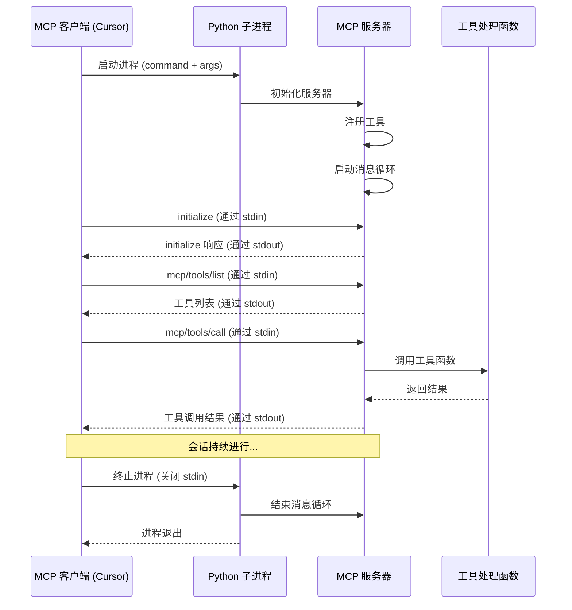

# stdio 模式下的 MCP 服务器调用流程

stdio（标准输入/输出）模式是 MCP 服务器的一种运行方式，它允许 MCP 客户端（如 Cursor IDE、Claude Desktop）通过标准输入/输出流与本地运行的 MCP 服务器进行通信。这种模式特别适合于在本地环境中运行服务器，且由客户端直接管理服务器进程的场景。

## MCP stdio 模式的基本原理

在 stdio 模式下，MCP 协议利用标准输入（stdin）和标准输出（stdout）作为通信渠道：

1. 客户端**启动**服务器进程并将其标准输入/输出连接到客户端
2. 客户端通过**标准输入**向服务器发送请求（如 JSON-RPC 消息）
3. 服务器通过**标准输出**将结果发送回客户端
4. 所有通信都使用 JSON-RPC 2.0 消息格式

这种方法的优势在于简单性和安全性 - 服务运行在本地，无需网络连接，客户端能完全控制服务器进程的生命周期。

## Python MCP 服务器在 stdio 模式下的工作流程

以下是基于 Python 实现的 MCP 服务器在 stdio 模式下的详细调用流程：

### 1. 配置和启动阶段

1. **客户端读取配置**：客户端（如 Cursor）读取配置文件（例如 `.cursor/mcp.json`），获取 MCP 服务器的配置信息：

```json
{
  "mcpServers": {
    "python-example": {
      "command": "python",
      "args": ["/path/to/mcp_server.py"],
      "env": {
        "API_KEY": "value"
      }
    }
  }
}
```

2. **服务器进程创建**：客户端使用配置的命令和参数创建子进程，并设置环境变量：

```python
# 客户端内部实现（伪代码）
process = subprocess.Popen(
    ["python", "/path/to/mcp_server.py"],
    stdin=subprocess.PIPE,
    stdout=subprocess.PIPE,
    stderr=subprocess.PIPE,
    env={"API_KEY": "value"}
)
```

3. **服务器初始化**：服务器进程启动并进入消息循环，准备接收和处理来自标准输入的请求：

```python
# 服务器端 mcp_server.py 的实现
import json
import sys
from modelcontextprotocol.server.stdio import StdioServerTransport
from modelcontextprotocol.server import Server

# 创建 MCP 服务器
server = Server(
    name="example-server",
    version="1.0.0",
    capabilities={
        "tools": {}
    }
)

# 创建 stdio 传输层
transport = StdioServerTransport()

# 注册工具
@server.tool("hello_world", "A simple greeting tool")
def hello_world(name: str) -> str:
    return f"Hello, {name}!"

# 连接传输层并进入消息循环
server.connect(transport)
```

### 2. 客户端与服务器的通信过程

1. **初始化请求**：客户端发送初始化请求到服务器：

```json
{
  "jsonrpc": "2.0",
  "id": 1,
  "method": "initialize",
  "params": {
    "client_info": {
      "name": "Cursor",
      "version": "0.10.0"
    },
    "capabilities": {
      "tools": {},
      "resources": {},
      "prompts": {}
    }
  }
}
```

2. **服务器响应**：服务器通过 stdout 发送回初始化响应：

```json
{
  "jsonrpc": "2.0",
  "id": 1,
  "result": {
    "server_info": {
      "name": "example-server",
      "version": "1.0.0"
    },
    "capabilities": {
      "tools": {}
    }
  }
}
```

3. **工具发现**：客户端发送请求获取可用工具：

```json
{
  "jsonrpc": "2.0",
  "id": 2,
  "method": "mcp/tools/list",
  "params": {}
}
```

4. **服务器返回工具列表**：

```json
{
  "jsonrpc": "2.0",
  "id": 2,
  "result": {
    "tools": [
      {
        "name": "hello_world",
        "description": "A simple greeting tool",
        "parameters": {
          "type": "object",
          "properties": {
            "name": {
              "type": "string"
            }
          },
          "required": ["name"]
        }
      }
    ]
  }
}
```

### 3. 工具调用过程

1. **客户端发送工具调用请求**：

```json
{
  "jsonrpc": "2.0",
  "id": 3,
  "method": "mcp/tools/call",
  "params": {
    "name": "hello_world",
    "arguments": {
      "name": "World"
    }
  }
}
```

2. **服务器处理工具调用**：
   - 服务器接收到请求并解析 JSON-RPC 消息
   - 查找名为 "hello_world" 的工具
   - 调用相关函数并传入参数
   - 将函数返回值包装为响应

3. **服务器返回调用结果**：

```json
{
  "jsonrpc": "2.0",
  "id": 3,
  "result": {
    "content": "Hello, World!",
    "is_error": false
  }
}
```

### 4. 实现细节和流程图



### 5. 关键技术实现

以下是 Python MCP 服务器实现 stdio 模式通信的关键代码：

```python
# StdioServerTransport 的简化实现
class StdioServerTransport:
    def __init__(self):
        self.stdin = sys.stdin
        self.stdout = sys.stdout
        # 使用二进制模式避免换行符问题
        self.stdin_buffer = sys.stdin.buffer
        self.stdout_buffer = sys.stdout.buffer
        
    def receive_message(self):
        # 从标准输入读取一行 JSON
        line = self.stdin_buffer.readline()
        if not line:  # EOF，客户端已关闭连接
            return None
        
        # 解析 JSON-RPC 消息
        try:
            message = json.loads(line.decode('utf-8'))
            return message
        except json.JSONDecodeError:
            return None
    
    def send_message(self, message):
        # 将消息序列化为 JSON
        json_str = json.dumps(message)
        
        # 写入标准输出并刷新
        self.stdout_buffer.write((json_str + '\n').encode('utf-8'))
        self.stdout_buffer.flush()
        
    def start(self):
        # 进入消息循环
        while True:
            message = self.receive_message()
            if message is None:
                break  # 客户端关闭连接
                
            # 处理消息并生成响应
            response = self.handle_message(message)
            if response:
                self.send_message(response)
```

## 优势与挑战

### stdio 模式的优势

1. **简单性**: 无需设置网络服务器，直接使用标准 I/O 流
2. **安全性**: 通信限于本地进程，无需网络访问或安全凭证
3. **易于集成**: 客户端可以完全控制服务器进程的生命周期
4. **低延迟**: 进程间通信非常快速
5. **多语言支持**: 任何支持标准 I/O 的语言都可以实现

### stdio 模式的挑战

1. **单机限制**: 只能在同一台机器上运行客户端和服务器
2. **进程管理复杂性**: 客户端负责启动、监控和终止服务器进程
3. **没有内置的并发模型**: 每个进程通常处理一个连接
4. **排错困难**: 错误消息混在 JSON-RPC 流中，不易调试

## 总结

stdio 模式是 MCP 服务器的一种轻量级、安全的本地运行方式，特别适合 IDE 集成和桌面应用场景。通过标准输入输出进行基于 JSON-RPC 的通信，使得客户端可以方便地与本地服务器交互。

Python 实现的 MCP 服务器利用内置的 stdin/stdout 处理能力，无需额外的网络库，即可提供完整的 MCP 功能。这种设计既保证了简单性，又提供了足够的扩展性，使开发者能够轻松构建自定义的 MCP 工具和能力。
