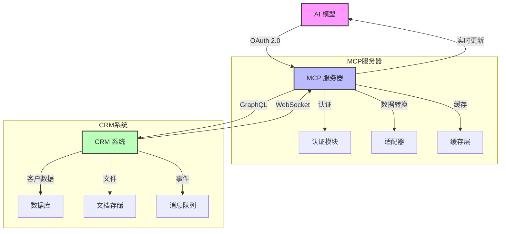
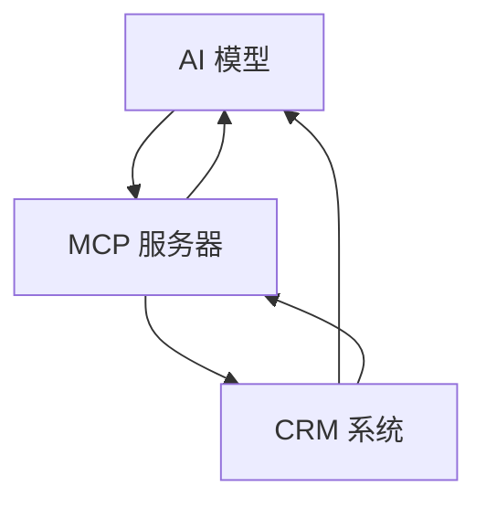

# MCP 实例：数据分析集成

## 场景

假设有一家公司，DataCorp，希望通过将 AI 模型与现有数据基础设施集成来增强其数据分析能力。他们决定使用 MCP 来实现 AI 模型与数据资源之间的无缝交互。

## MCP 解决的问题

DataCorp 需要一种标准化的方法来允许 AI 模型访问和交互各种数据源，如数据库和文件系统，而不影响安全性或性能。MCP 提供了一个统一的协议来实现这种交互，确保一致的行为和易于集成。

## 使用的技术

1. **OAuth 2.0 认证与授权**：
   - MCP 使用 OAuth 2.0 来安全地验证用户身份并授权访问数据资源。这确保了只有授权的用户和应用程序才能访问敏感数据。

2. **RESTful API 通信**：
   - MCP 利用 RESTful API 来促进 AI 模型与数据资源之间的通信。这允许与现有系统轻松集成，并为数据访问提供可扩展的解决方案。

3. **WebSockets 实时交互**：
   - 对于需要实时数据更新的场景，MCP 使用 WebSockets 在 AI 模型和数据源之间保持持久连接。这使得数据检索和更新能够即时进行。

4. **JSON 数据交换**：
   - MCP 使用 JSON 作为数据交换的标准格式，确保与广泛的系统兼容，并简化数据解析和操作。

## 示例工作流程

1. **初始化**：
   - DataCorp 的 AI 模型使用 OAuth 2.0 进行身份验证，启动与 MCP 服务器的连接。
   - 服务器验证凭据并建立安全会话。

2. **数据访问**：
   - AI 模型向 MCP 服务器发送 RESTful API 请求以访问特定的数据库表。
   - 服务器处理请求，检索数据，并以 JSON 格式返回。

3. **实时更新**：
   - AI 模型使用 WebSockets 订阅数据库表的实时更新。
   - 每当数据更改时，MCP 服务器会立即将更新推送到 AI 模型。

4. **会话管理**：
   - MCP 服务器维护会话状态，确保 AI 模型的上下文在交互中得到保留。
   - 当 AI 模型完成任务时，会话安全终止。

## 实际例子：使用 MCP 增强客户支持系统

**场景：**

一家名为 SupportTech 的公司需要提升其客服效率。他们有以下需求：
1. 自动处理重复性客户询问
2. 实时访问客户历史数据
3. 智能分类和路由支持票
4. 提供多语言客户支持
5. 记录和分析客户互动模式

**MCP 如何解决问题：**

1. **统一访问层**：
   - MCP 在 AI 模型和 CRM 系统之间建立标准化的通信协议
   ```markdown
   **协议特性**：
   - 基于 OpenAPI 3.0 规范定义接口
   - 支持服务发现机制（通过 /.well-known/mcp.json）
   - 包含机器可读的协议描述元数据
   - 支持协议版本协商（Accept-Version 头）
   ```
   
   ```json
   {
     "mcp_version": "1.2.0",
     "protocols": {
       "rest": "/api/docs/openapi.yaml",
       "graphql": "/api/graphql/schema",
       "websocket": "/realtime/v1"
     },
     "auth_schemes": ["OAuth2", "JWT"]
   }
   ```

2. **数据安全性**：
   - 实现细粒度的访问控制
   - 加密所有传输中的数据
   - 提供审计跟踪功能

3. **性能优化**：
   - 实现数据缓存机制
   - 支持批量操作
   - 提供数据压缩

**技术实现细节：**

1. **OAuth 2.0 安全访问：**
   ```json
   {
     "grant_type": "client_credentials",
     "client_id": "ai_model_id",
     "client_secret": "************",
     "scope": "read:customer_data write:tickets"
   }
   ```

2. **GraphQL 查询示例：**
   ```graphql
   query GetCustomerInfo($ticketId: ID!) {
     ticket(id: $ticketId) {
       customer {
         id
         name
         history {
           previousTickets {
             issue
             resolution
           }
           preferences
           language
         }
       }
     }
   }
   ```

3. **WebSocket 事件处理：**
   ```javascript
   // WebSocket 连接示例
   const ws = new WebSocket('wss://mcp.supporttech.com/tickets/stream');
   ws.onmessage = (event) => {
     const update = JSON.parse(event.data);
     if (update.type === 'ticket_update') {
       processTicketUpdate(update);
     }
   };
   ```

4. **协议自说明机制**：
   ```yaml
   # OpenAPI 元数据示例
   openapi: 3.0.0
   info:
     title: MCP Customer API
     version: 1.0.0
     description: |
       包含以下能力：
       - 自动服务发现
       - 协议版本协商
       - 动态Schema加载
   paths:
     /.well-known/mcp.json:
       get:
         summary: 服务发现端点
         responses:
           '200':
             description: 返回可用协议和接口描述
   ```

5. **动态协议协商**：
   ```http
   GET /api/customer/123 HTTP/1.1
   Accept: application/vnd.mcp.v2+json
   Accept-Protocol: graphql,rest
   ```

**工作流程示例：**

1. **初始化流程：**
   - AI 模型请求访问令牌
   - MCP 服务器验证凭据
   - 建立加密的 WebSocket 连接
   - 初始化会话上下文

2. **数据交互流程：**
   - 接收客户查询
   - 通过 GraphQL 获取相关上下文
   - 实时订阅更新
   - 生成和发送响应

3. **会话管理：**
   - 维护对话状态
   - 处理上下文切换
   - 管理资源释放
   - 记录交互历史

**系统架构图：**



**关键技术指标：**

1. **性能指标：**
   - 响应时间 < 100ms
   - 并发连接 > 10000
   - 数据吞吐量 > 1GB/s

2. **安全指标：**
   - 所有通信使用 TLS 1.3
   - 支持 JWT 令牌轮换
   - 实时威胁检测

3. **可靠性指标：**
   - 服务可用性 > 99.99%
   - 自动故障转移
   - 数据一致性保证

**图书：**

为了可视化和更好地理解 MCP 的工作流程，可以使用以下 Mermaid 图表：



# 文档内容分析及改进建议

## 一、技术实现问题
1. **协议混合问题**：
   - 前文强调使用 RESTful API，但示例中出现 GraphQL
   - 建议：统一协议类型或明确说明支持多协议

2. **RESTful API 通信**：
   - MCP 利用 RESTful API 来促进 AI 模型与数据资源之间的通信
   - 建议：统一协议类型或明确说明支持多协议

2. **GraphQL 查询示例**：
   ```graphql
   query GetCustomerInfo($ticketId: ID!) {
     ticket(id: $ticketId) {
       customer {
         id
         name
         history {
           previousTickets {
             issue
             resolution
           }
           preferences
           language
         }
       }
     }
   }
   ```

3. **安全实现细节**：
   - 实现细粒度的访问控制
   - 加密所有传输中的数据
   - 提供审计跟踪功能

3. **WebSockets 实时交互**：
   - MCP 使用 WebSockets 在 AI 模型和数据源之间保持持久连接
   ```javascript
   const ws = new WebSocket('wss://mcp.supporttech.com/tickets/stream');
   ```

## 二、架构图问题
- 架构图中同时存在中文和英文标签（"MCP服务器" vs "CRM系统"）
- 建议：统一使用中文或英文标签

## 三、数据指标问题
- 指标数值缺乏上下文（如硬件配置、测试环境）
- 建议：补充测试环境说明或添加注释说明理论值

## 四、其他改进建议
1. **术语统一**：
   - 将全文的 "WebSockets" 统一为 "WebSocket"
   - 将 "图书" 改为 "架构图"（原内容疑似翻译错误）

2. **代码注释增强**：
   - 添加错误处理逻辑
   ```javascript
   ws.onerror = (error) => {
     console.error('WebSocket Error:', error);
     reconnect();
   };
   ```

3. **会话管理增强**：
   - 补充会话超时机制和心跳检测说明

**总结建议**：文档整体结构完整，但需要加强技术细节的准确性和实现方案的完整性，建议重点完善协议规范、安全机制和指标说明等关键技术细节。 