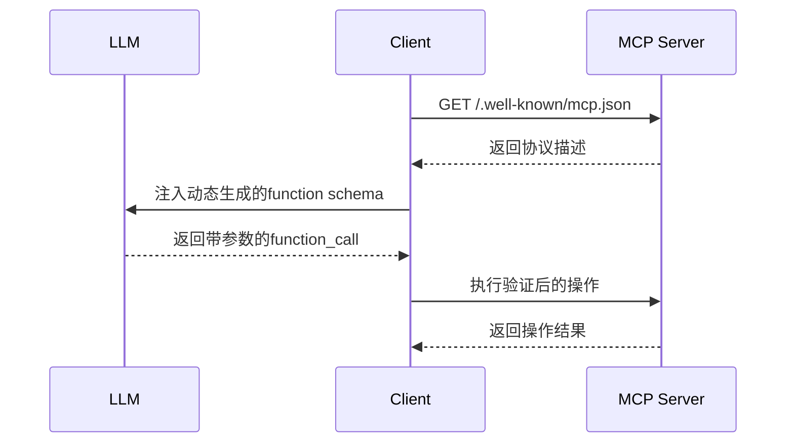
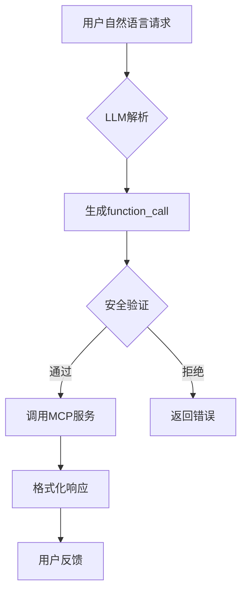

# MCP 客户端 LLM 集成方案

## 服务发现与动态绑定
1. **自动生成 Function Schema**：
```python
# MCP 服务发现 → LLM Function 转换
def generate_function_schema(service_discovery):
    return {
        "name": service_discovery["service_name"] + "_operations",
        "parameters": {
            "type": "object",
            "properties": {
                "operation": {"enum": service_discovery["allowed_actions"]},
                "path": {"type": "string", "format": "uri-reference"},
                "content": {"type": "string"}  # 动态字段
            },
            "required": ["operation", "path"]
        }
    }
```

2. **运行时绑定机制**：


## 核心交互流程
1. **自然语言处理**：
```python
# 用户请求示例
user_query = "请帮我分析最近3天/data目录下的日志文件"
```

2. **Function Calling 决策**：
```json
// LLM 生成的调用参数
{
  "function": "file_operations",
  "arguments": {
    "operation": "analyze_logs",
    "path": "/data",
    "filter": "modified_time > now()-3d"
  }
}
```

3. **安全执行层**：
```python
def execute_operation(params):
    # 权限验证
    if not validate_scope(params["operation"]):
        raise PermissionError("操作未授权")
    
    # 路径白名单检查
    sanitized_path = sanitize_path(params["path"]) 
    
    # 调用 MCP 服务
    response = mcp_client.request(
        operation=params["operation"],
        path=sanitized_path,
        params=params.get("filter")
    )
    
    # 记录审计日志
    audit_log.log({
        "operation": params["operation"],
        "path": sanitized_path,
        "user": current_user
    })
    
    return response
```

## 动态接口适配
1. **协议协商机制**：
```http
GET /api/filesystem HTTP/1.1
Accept: application/vnd.mcp.v2+json
Accept-Protocol: graphql
```

2. **多模态响应处理**：
```python
# 处理 MCP 响应并生成自然语言解释
def format_response(response):
    if response.status == "success":
        return f"操作成功完成。详细信息：{response.summary}"
    else:
        error_info = parse_error(response.raw_data)
        return f"遇到错误：{error_info['code']} - {error_info['message']}"
```

## 安全控制体系

yaml
安全策略配置
access_control:
pattern: /data/logs/
allowed_actions: [read, analyze]
required_scopes: [logs.read]
max_frequency: 10/分钟
pattern: /system/
allowed_actions: [read]
required_scopes: [admin.read]
ip_whitelist: [192.168.1.0/24]

## 典型工作流程



**核心优势**：
1. 动态服务发现减少硬编码
2. 自然语言到协议操作的智能转换
3. 分层安全控制保障系统安全
4. 审计追踪满足合规要求

完整实现参考：[MCP 客户端实现库](https://github.com/modelcontextprotocol/clients/tree/main/js-client)